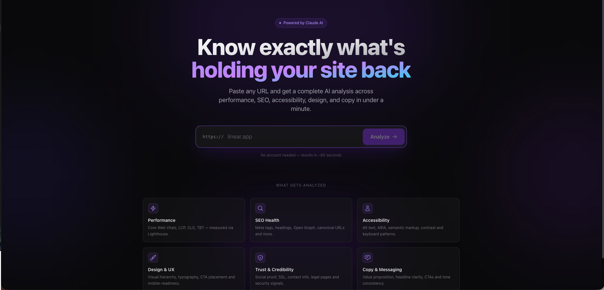
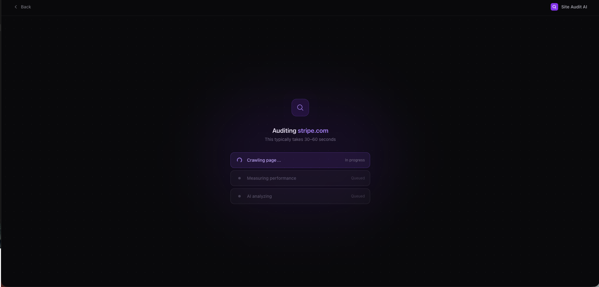
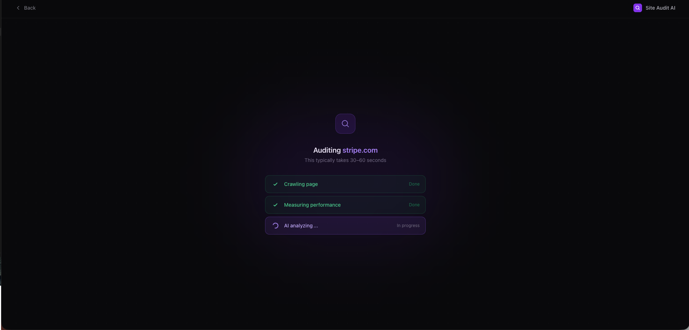
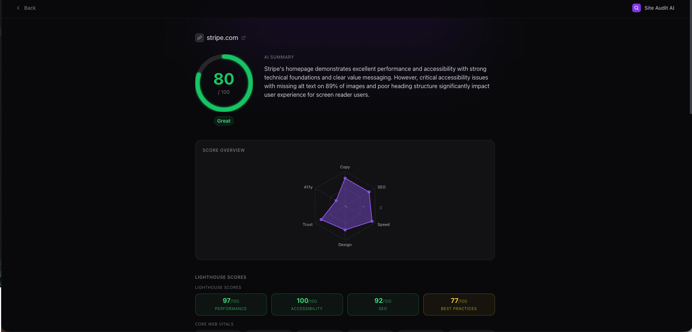
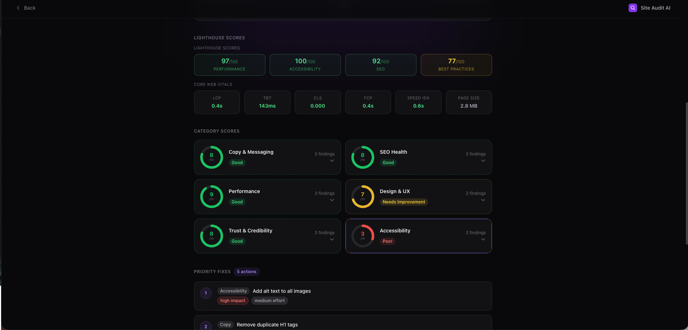
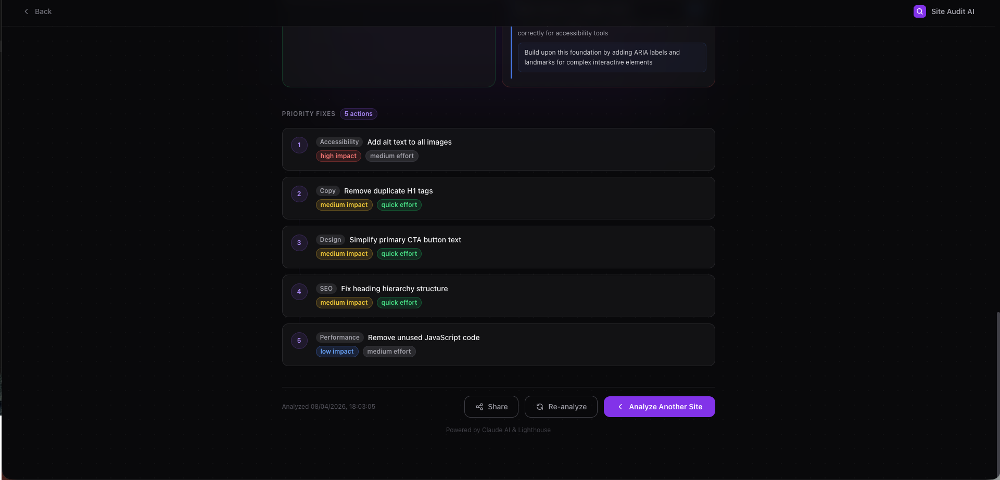
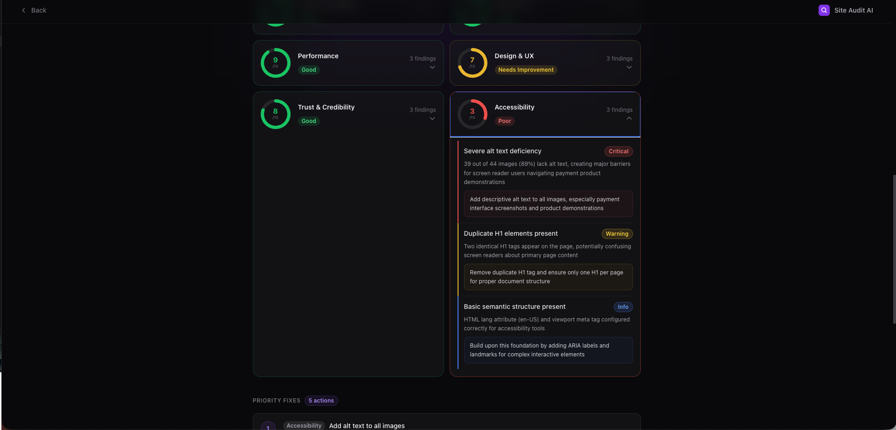

# Site Audit AI

An AI-powered website analyzer that crawls any URL, runs Google Lighthouse performance audits, and uses an LLM-based AI agent (Claude) with tool calling to deliver actionable insights across 6 categories — copy, SEO, performance, design, trust, and accessibility.

**Live Demo:** Deployed on AWS EC2 — instance available on request for live walkthrough.

## Screenshots

### Landing Page


### Analyzing a Website




### Results Dashboard





## How It Works

1. **Crawl** — Playwright headless browser loads the page and extracts content: headings, meta tags, images, links, CTAs, colors, fonts, and page structure
2. **Measure** — Google Lighthouse CLI runs performance, accessibility, SEO, and best practices audits with Core Web Vitals (LCP, TBT, CLS, FCP)
3. **Analyze** — An LLM-powered AI agent (Claude) examines all collected data, autonomously decides which tools to call (image size checker, broken link detector), gathers additional evidence across multi-turn reasoning loops, and produces a scored report with prioritized fix recommendations

## AI Agent Architecture

The analyzer uses Claude's tool-use API to act as an autonomous agent, not a single-shot LLM call:

- **Observe:** Claude receives structured crawl data + Lighthouse metrics
- **Decide:** Claude analyzes the data and decides which additional checks to run
- **Act:** Claude calls tools — `check_image_sizes` (fetches actual file sizes via HTTP HEAD requests), `check_broken_links` (validates internal/external URLs)
- **Iterate:** Results are fed back to Claude for deeper analysis (up to 3 rounds)
- **Report:** Claude produces a final scored report with findings and recommendations

This agent loop means different websites get different investigations based on what Claude identifies as potential issues.

## Tech Stack

| Layer | Technology |
|-------|-----------|
| Backend | Python, FastAPI, async/await |
| Web Crawling | Playwright (headless Chromium) |
| Performance Auditing | Google Lighthouse CLI |
| AI/LLM | Anthropic Claude API (tool-use) |
| Frontend | React, Tailwind CSS, Recharts, Vite |
| Database | PostgreSQL (production), SQLite (development) |
| Caching | Redis (24-hour TTL) |
| Containerization | Docker, Docker Compose |
| Deployment | AWS EC2, Nginx reverse proxy |

## Analysis Categories

| Category | What It Measures |
|----------|-----------------|
| Copy and Messaging | Headline clarity, value proposition, CTA quality, tone consistency |
| SEO Health | Meta tags, heading hierarchy, image alt text, Open Graph, canonical URLs |
| Performance | Core Web Vitals (LCP, TBT, CLS, FCP), page size, render-blocking resources |
| Design and UX | CTA placement, typography, color contrast, mobile responsiveness |
| Trust and Credibility | Social proof, SSL, contact info, privacy policy, security signals |
| Accessibility | Alt text coverage, semantic HTML, ARIA attributes, keyboard navigation |

## Project Structure

```
site-audit/
├── backend/
│   ├── app/
│   │   ├── api/routes.py              # API endpoints with background job processing
│   │   ├── services/
│   │   │   ├── crawler.py             # Playwright web crawler with timeout handling
│   │   │   ├── lighthouse.py          # Lighthouse CLI subprocess integration
│   │   │   └── analyzer.py            # Claude AI agent with tool-use loop
│   │   ├── models/audit.py            # SQLAlchemy models
│   │   ├── schemas/audit.py           # Pydantic request/response schemas
│   │   ├── config.py                  # Environment configuration
│   │   └── database.py                # Database and Redis connection
│   ├── Dockerfile
│   └── requirements.txt
├── frontend/
│   ├── src/
│   │   ├── pages/                     # Landing page and Results page
│   │   └── components/                # Reusable UI components
│   ├── Dockerfile
│   └── nginx.conf
├── docker-compose.yml
├── screenshots/
└── README.md
```

## Local Development

### Backend

```bash
cd backend
python3 -m venv .venv
source .venv/bin/activate
pip install -r requirements.txt
playwright install chromium
cp .env.example .env  # Add your ANTHROPIC_API_KEY
uvicorn app.main:app --reload --port 8000
```

### Frontend

```bash
cd frontend
npm install
npm run dev
```

Open http://localhost:3000 to use the app.

## Production Deployment (AWS EC2)

```bash
git clone https://github.com/adityab39/site-audit.git
cd site-audit
cp backend/.env.example backend/.env
# Add ANTHROPIC_API_KEY and production database URL to backend/.env
docker compose up --build -d
```

The app runs on port 80 via Nginx reverse proxy with Docker Compose orchestrating 4 services: FastAPI backend, React frontend (Nginx), PostgreSQL, and Redis.

## API Endpoints

| Method | Endpoint | Description |
|--------|----------|-------------|
| POST | /api/audit | Submit a URL for analysis |
| GET | /api/audit/{job_id} | Get audit status and results |
| GET | /api/audit/history | Recent audits list |
| GET | /health | Health check |

## Environment Variables

| Variable | Description | Required |
|----------|-------------|----------|
| ANTHROPIC_API_KEY | Claude API key | Yes |
| DATABASE_URL | Database connection string | Yes |
| REDIS_URL | Redis connection string | No |
| REDIS_ENABLED | Enable/disable caching (true/false) | No |
| LIGHTHOUSE_CHROME_PATH | Path to Chrome binary | No |
